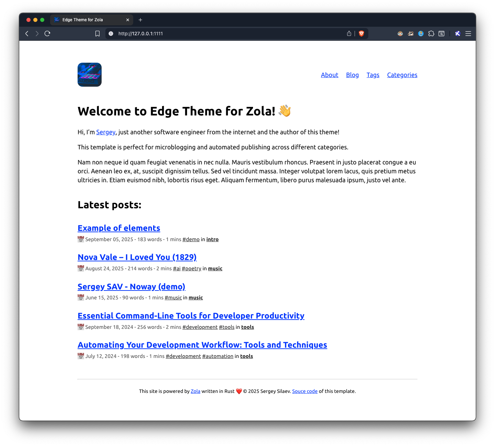
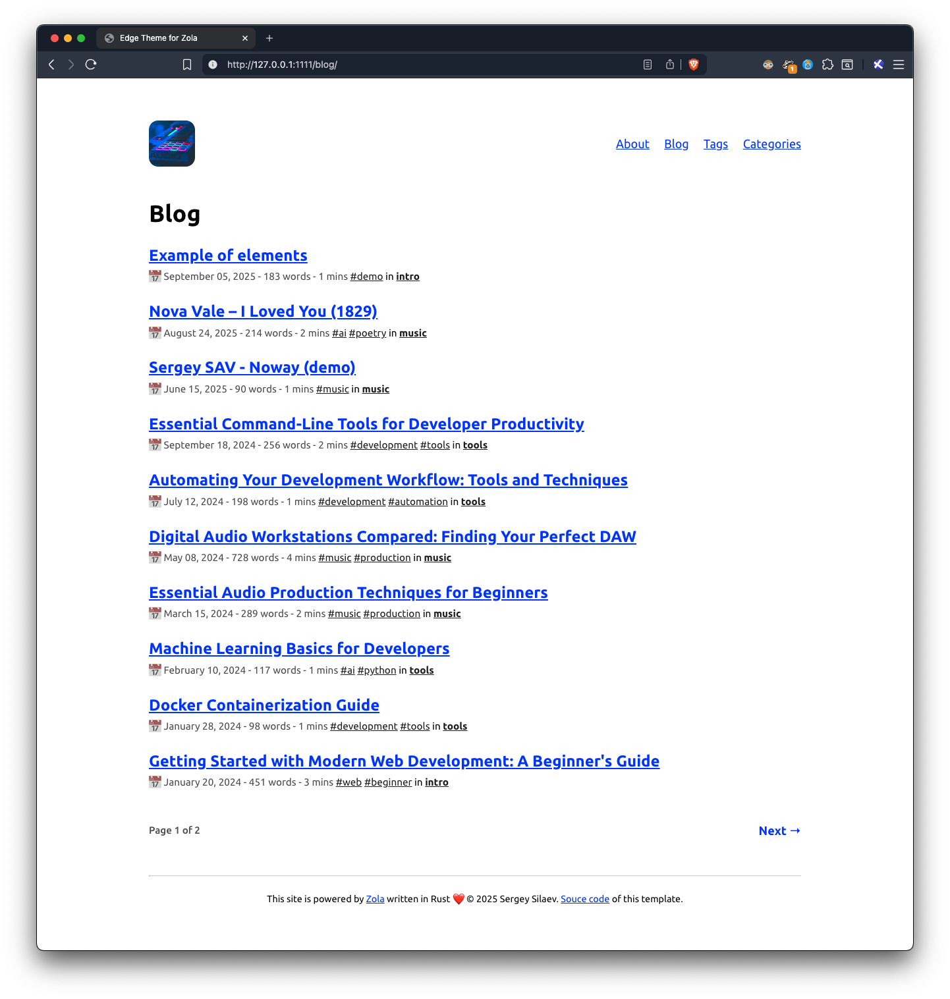

# Edge

A lightweight, responsive, and minimalist theme for [Zola](https://www.getzola.org/).




## Quick Start

**Just want to start blogging? Follow these 4 simple steps:**

1. **Install Zola** (one-time setup):
   - **macOS**: `brew install zola`
   - **Windows**: `winget install getzola.zola`
   - **Linux**: `sudo snap install zola --edge`
   - [Other installation methods](https://www.getzola.org/documentation/getting-started/installation/)

2. **Clone this repository as your new blog**:
```bash
git clone https://github.com/sesav/zola-theme-edge.git my-blog
cd my-blog
```

3. **Customize your site** (edit the basic settings):
```bash
nvim config.toml  # or nano, code, etc.
```
Update these key settings:
- `title` - Your blog name
- `description` - Brief description of your blog
- `base_url` - Your domain (use `http://127.0.0.1:1111` for local development)
- `email` - Your contact email

4. **Start blogging**:
```bash
# Start the development server
zola serve

# Your blog is now running at http://127.0.0.1:1111
```

**That's it!** Your blog is ready. To create your first post, add a new `.md` file in the `content/blog/` directory.

### Creating Your First Post
```bash
# Create a new blog post
touch content/blog/my-first-post.md
```

Add this content to get started:
```markdown
+++
title = "My First Blog Post"
date = 2024-01-01
description = "Welcome to my new blog!"
[taxonomies]
tags = ["hello-world"]
categories = ["tools"]
+++

# Welcome to my blog!

This is my first post using the Edge theme for Zola. 
I can write in **Markdown** and it looks great!
```

**Ready to deploy?** Run `zola build` and upload the `public/` folder to any static hosting service
like Netlify, Vercel, or GitHub Pages. Profit! 👌.


## Installation as a Zola theme

### Method 1: Git Submodule (Recommended)
```bash
cd your-zola-site
git submodule add https://github.com/sesav/zola-theme-edge.git themes/edge
git submodule update --init --recursive
```

### Method 2: Direct Clone
```bash
cd your-zola-site
git clone https://github.com/sesav/zola-theme-edge.git themes/edge
```

## Configuration

1. **Copy the example configuration** from `themes/edge/config.toml` to your root `config.toml`:
```bash
cp themes/edge/config.toml config.toml
```

2. **Enable the theme** in your root `config.toml`:
```toml
theme = "edge"
```

3. **Add required taxonomies** to your `config.toml`:
```toml
taxonomies = [
  { name = "tags", feed = true },
  { name = "categories", feed = true }
]
```

## Theme Customization

Edge provides extensive customization options through your `config.toml` file:

### Visual Customization
- **Primary Color**: Main accent color for links and highlights (`primary = "#002fff"`)
- **Secondary Color**: Secondary text and border color (`secondary = "#555"`)
- **Site Icon**: Custom favicon and site icon (`icon = "icon.jpg"`)
- **Typography**: Built-in support for system fonts with fallbacks

### Navigation Configuration
- **Custom Menu**: Define navigation items with names and paths
- **Footer Content**: Markdown-supported footer text with links and copyright
- **Contact Information**: Email address display and linking

### Content Settings
- **Latest Posts**: Configure the number of recent posts to display (`latest_posts_num = 5`)
- **Post Excerpts**: Automatic excerpt generation from content
- **Reading Time**: Built-in reading time estimation
- **Syntax Highlighting**: Multiple theme options (`highlight_theme = "boron"`)

## Content Structure

Edge supports a flexible content organization:

### Blog Posts
Create blog posts in `content/blog/` directory:
```
content/
└── blog/
    ├── _index.md          # Blog section page
    ├── my-first-post.md   # Individual blog post
    └── another-post.md    # Another blog post
```

### Static Pages
Create standalone pages in the `content/` directory:
```
content/
├── about.md              # About page
├── contact.md            # Contact page
└── projects/             # Projects section
    ├── _index.md
    └── project-one.md
```

### Front Matter Options
Each page supports these front matter variables:
```toml
+++
title = "Your Post Title"
date = 2024-01-01
description = "Post description for SEO"
[taxonomies]
tags = ["tag1", "tag2"]
categories = ["category1"]
+++
```

### Shortcodes
Edge includes useful shortcodes:
- **YouTube**: Embed responsive YouTube videos
- **Image**: Optimized image display with captions

## Development

### Local Development
```bash
# Serve with live reload
zola serve

# Build for production
zola build
```

### Sass Compilation
The theme uses Sass for styling with:
- Normalize.css for cross-browser consistency
- CSS custom properties for theme customization
- Mobile-first responsive design approach

### Directory Structure
```
edge/
├── config.toml           # Example configuration
├── sass/
│   ├── _normalize.scss   # CSS reset
│   └── style.scss        # Main theme styles
├── static/
│   └── favicon.ico       # Default favicon
├── templates/
│   ├── base.html         # Base template
│   ├── index.html        # Homepage template
│   ├── blog.html         # Blog listing template
│   ├── blog-post.html    # Individual post template
│   ├── page.html         # Static page template
│   └── 404.html          # Error page template
└── content/              # Example content
    └── blog/
```

## Browser Support

Edge is tested and supported on:
- Chrome/Chromium 90+
- Firefox 88+
- Safari 14+
- Edge 90+


## License

This theme is open source and available under the [MIT License](LICENSE).
